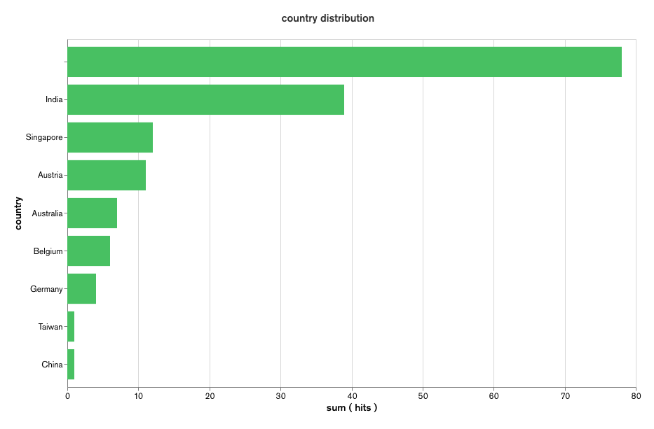

# Introduction
```
trafczar ipinfo --help                                                                                              ✔  5244  03:05:00
Fetch the location information of the IP

Usage:
  trafczar ipinfo [flags]

Flags:
  -c, --config string     The path to the configuration JSON file
  -h, --help              help for ipinfo
      --ip string         IP address of the target
  -p, --persist           Do you want to store the response to mongo? If yes, please provide value to --config flag
  -s, --read-stream       Do you want to read from tcpdump output contineously?
  -t, --tcp-dump string   source file of tcpdump
```

There are three ways you can lookup location details of IP.
1. Lookup single IP or domain name. Eg. `trafczar ipinfo --ip netflix.com`  
2. Parse `tcpdump` log. Eg. `trafczar ipinfo --tcp-dump server.log`  
3. See the location details of incoming traffic in real tim. `trafczar ipinfo -s`   
If you want to store it to db, you can provide details in `config.json` at root dir, then use `trafczar ipinfo -s -p -c config.json`  
[Youtube link for the video demonstration](https://youtu.be/rdE3cGBT_wA)


